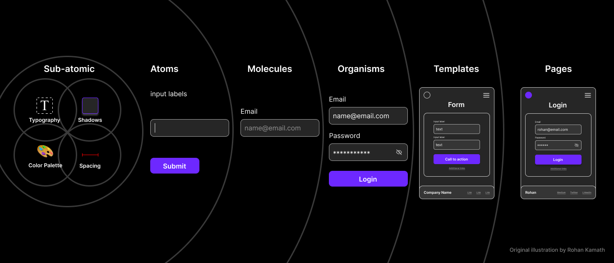

<div align="center"></div>
<h1 align="center" style="margin: 0;">Props.to</h1>

<p align="center" style="margin-top: 20px">
  <p align="center">
  Open Source Feedback Infrastructure
  <br>
    <a href="https://props.to"><strong>Learn more »</strong></a>
    <br />
    <br />
    <a href="https://props.to">Website</a>
    ·
    <a href="https://github.com/propsto/props.to/issues">Issues</a>
    ·
    <a href="https://github.com/propsto/props.to/milestones">Roadmap</a>
  </p>
</p>

<p align="center">
  
  
  <br/>
  <a href="https://docs.props.to" title="Proudly supported by GitBook">
  </a>&nbsp;<a href="https://neon.tech" title="Using the best database system, Neon"></a>
&nbsp;<a href="https://resend.com" title="Using the best emailing system, Resend"></a>
</p>

## About this project

Props.to is the open-source infrastructure for owning feedback across public and private channels. It helps people and teams collect, verify, and publish feedback from any connected profile while keeping ownership in their hands. Private feedback can be promoted to public testimonials, and feedback that arrives before an account is claimed is held until the owner connects it.

### Highlights

- Multi-app monorepo powering marketing, authentication, and the core product surface.
- Shared TypeScript packages for UI, email, data, and runtime configuration.
- Prisma-backed Postgres database with local Docker automation and seeding routines.
- Auth.js-powered identity flows with first-party email delivery.
- Full Playwright E2E suites running alongside unit and integration tests.

## Tech stack

- Next.js 15 + React 19 for all user-facing apps.
- Auth.js with email and OAuth providers.
- Prisma ORM with PostgreSQL and Resend/Nodemailer for outbound email.
- Turborepo + pnpm workspace for orchestration and caching.
- Tailwind CSS 4, shadcn/ui fragments, and an Atomic Design system in `packages/ui`.

## Monorepo layout

```
.
├─ apps/
│  ├─ app/            # Authenticated product experience
│  ├─ auth/           # Auth.js-powered identity and onboarding flows
│  ├─ docs/           # GitBook-backed legal and documentation site
│  └─ web/            # Marketing site and landing pages
├─ packages/
│  ├─ config/         # Shared ESLint, TS, and tooling configs
│  ├─ constants/      # Runtime env validation and cross-app constants
│  ├─ data/           # Prisma schema, migrations, and database scripts
│  ├─ email/          # Transactional email handlers, templates, and maildev setup
│  ├─ logger/         # Structured logging helpers
│  └─ ui/             # Design system built with shadcn/ui and Atomic Design
├─ e2e/
│  ├─ app/            # Playwright journeys for the authenticated app
│  └─ auth/           # Playwright coverage for sign-in and onboarding
├─ examples/          # Component and RSC experiments
├─ turbo.json         # Turborepo pipeline configuration
└─ pnpm-workspace.yaml  # Workspace definition and build overrides
```

## Getting started

### Prerequisites

- Node.js 20+ and pnpm 9+ (`packageManager` is pinned to pnpm 10.12.4).
- Docker (for the local Postgres container managed by Prisma scripts).
- Host file edit permissions (required by `pnpm setup:hosts`).
- Optional: Resend account and Google OAuth credentials for full feature coverage.

### Bootstrap the workspace

1. Install dependencies:
   ```bash
   pnpm install
   ```
2. Copy and adjust the environment variables:
   ```bash
   cp .env.example .env
   ```
3. Provision the local database (Docker + Prisma migrate + seed):
   ```bash
   pnpm dev:setup
   ```
4. **Choose your local development setup** (see options below)
5. Launch the product surface you want to build against (starts Auth, App, MailDev, and Prisma Studio):
   ```bash
   pnpm dev:app
   ```

### Local development options

There are two ways to run the apps locally:

#### Option A: Localhost with ports (simpler)

Use different ports on `localhost` for each app. This is the simplest setup but **does not support subdomain-based SSO testing**.

Update your `.env`:

```bash
PROPSTO_HOST="localhost"

PROPSTO_APP_PORT="3000"
PROPSTO_APP_HOSTNAME="localhost"

PROPSTO_WEB_PORT="3001"
PROPSTO_WEB_HOSTNAME="localhost"

PROPSTO_AUTH_PORT="3002"
PROPSTO_AUTH_HOSTNAME="localhost"

AUTH_URL="http://localhost:3002"
NEXT_PUBLIC_AUTH_URL="http://localhost:3002"
PROPSTO_APP_URL="http://localhost:3000"
```

Access the apps at:

- `http://localhost:3002` – Auth app
- `http://localhost:3000` – Product app
- `http://localhost:3001` – Marketing site

#### Option B: Custom domain with subdomains (recommended for full testing)

Use subdomain-based URLs which enables **SSO testing across apps**. Requires adding entries to your hosts file.

1. Add the local domain mappings (requires sudo/admin rights):

   ```bash
   sudo pnpm setup:hosts
   ```

   This adds the entries from `hosts.txt` to your system's hosts file, mapping `props.local` and its subdomains to `127.0.0.1`.

2. Use the default `.env.example` values (or adjust as needed):

   ```bash
   PROPSTO_HOST="props.local"

   PROPSTO_APP_PORT="3000"
   PROPSTO_APP_HOSTNAME="app.props.local"

   PROPSTO_WEB_PORT="3001"
   PROPSTO_WEB_HOSTNAME="props.local"

   PROPSTO_AUTH_PORT="3002"
   PROPSTO_AUTH_HOSTNAME="auth.props.local"

   AUTH_URL="http://auth.props.local:3002"
   NEXT_PUBLIC_AUTH_URL="http://auth.props.local:3002"
   PROPSTO_APP_URL="http://app.props.local:3000"
   ```

Access the apps at:

- `http://auth.props.local:3002` – Auth app
- `http://app.props.local:3000` – Product app
- `http://props.local:3001` – Marketing site

### Additional local services

Regardless of which option you choose:

- `http://0.0.0.0:1080` – MailDev inbox (local email testing)
- `http://localhost:5555` – Prisma Studio (database browser, auto-opened by setup)

### Useful scripts

- `pnpm dev` – Run all dev tasks except `@propsto/email` MailDev (handy for web + auth work).
- `pnpm dev:web`, `pnpm dev:auth`, `pnpm dev:email` – Focused dev servers per app.
- `pnpm dev:nuke` / `pnpm dev:setup` – Reset and recreate the database container + data.
- `pnpm health` – Run linting and type-checking across the workspace.
- `pnpm format` – Apply Prettier (with sorted imports) to supported files.

### Testing

- `pnpm test` – Workspace unit and integration tests (Vitest where configured).
- `pnpm test:e2e` – Playwright suites in `e2e/app` and `e2e/auth` (depends on `setup:e2e`).
- `pnpm setup:e2e` – One-time Playwright browser install.

### Environment variables

All sensitive configuration lives in `.env` and is validated by the `@propsto/constants` package. Key entries to review:

- `DATABASE_URL`, `DIRECT_URL` – Postgres connection strings for Prisma and Accelerate.
- `AUTH_SECRET`, `AUTH_URL` – Auth.js configuration.
- `PROPSTO_*` – Hostnames and ports for individual Next.js apps.
- `EMAIL_SERVER`, `EMAIL_FROM`, `RESEND_API_KEY` – Email transport (MailDev locally, Resend in production).
- `BLOB_READ_WRITE_TOKEN` – Vercel Blob storage token used for assets (e.g., avatars).
- `GOOGLE_CLIENT_ID`, `GOOGLE_CLIENT_SECRET`, `GOOGLE_ALLOWED_HOSTED_DOMAINS` – OAuth provider settings.

## Self-hosting

### Infrastructure checklist

- PostgreSQL 13+ database (Neon, Supabase, RDS, or a managed Postgres cluster).
- Email transport: Resend (recommended) or any SMTP server compatible with Auth.js.
- Object storage: Vercel Blob (default) or an S3-compatible bucket; update tokens accordingly.
- Public DNS entries: `app`, `auth`, and root/`www` domains pointed at your proxy/load balancer.
- Optional: reverse proxy or ingress (Caddy, Nginx, Traefik) terminating TLS and forwarding to each Next.js app.

### Build + deploy workflow

1. Bootstrap dependencies on the target host:
   ```bash
   pnpm install --frozen-lockfile
   ```
2. Provision the database schema against your production Postgres instance:
   ```bash
   pnpm --filter @propsto/data db-deploy
   pnpm --filter @propsto/data db-seed   # optional; seed data assumes a fresh database
   ```
3. Build every app and package (Turbo handles dependency ordering):
   ```bash
   pnpm build
   ```
4. Launch the desired surfaces behind your process manager (pm2, systemd, Docker, etc.):
   ```bash
   pnpm --filter @propsto/web start   # Marketing site (port 3001 by default)
   pnpm --filter @propsto/auth start  # Authentication surface (port 3002)
   pnpm --filter @propsto/app start   # Product app (port 3000)
   ```
   Update your proxy to map each public hostname to the correct local port. For Dockerized hosting, place these commands in distinct containers built from the same artifact (`pnpm build` results).
5. Keep Prisma migrations in sync by running `pnpm --filter @propsto/data db-deploy` during each deploy (CI/CD step or post-deploy hook).

### Production environment variables

- Replace `PROPSTO_*_HOSTNAME` with your real domains (e.g., `app.example.com`).
- Set `PROPSTO_ENV=production` to enable production-specific logic.
- Configure Auth.js secrets (`AUTH_SECRET`, `AUTH_URL`) and OAuth providers (`GOOGLE_*`).
- Provide a production-ready email sender (`RESEND_API_KEY` or SMTP credentials via `EMAIL_SERVER`/`EMAIL_FROM`).
- Supply your storage token (`BLOB_READ_WRITE_TOKEN`) or swap the implementation to your provider of choice.

### Alternative: Vercel + managed services

- Each Next.js app can be deployed as a separate Vercel project pointing to the same repository and environment variables.
- Use Neon or Supabase for Postgres and Resend for transactional email.
- Trigger `pnpm --filter @propsto/data db-deploy` via a deploy hook (Vercel build step or GitHub Action) to keep Prisma migrations applied.
- For local feature parity (e.g., MailDev), retain the Docker-based tooling but disable those features in production by toggling environment variables.

If you adopt another hosting strategy, please open a PR or discussion so we can document the setup for others.

## Atomic design

Leveraging [shadcn/ui](https://ui.shadcn.com/) elements and [Atomic Design](https://atomicdesign.bradfrost.com/chapter-2/), the `ui` package holds all the different elements to create anything in the UI.

Just as a reference, here is how we like Atomic Design to work within this project and how it is structured inside `packages/ui`. Note that sub-atomic particles are given by our Tailwind CSS configuration file at `packages/ui/tailwind.config.ts`.


<sub>Illustration by Rohan Kamath from his Atomic Design article <a href="https://blog.kamathrohan.com/atomic-design-methodology-for-building-design-systems-f912cf714f53">here</a>.</sub>
